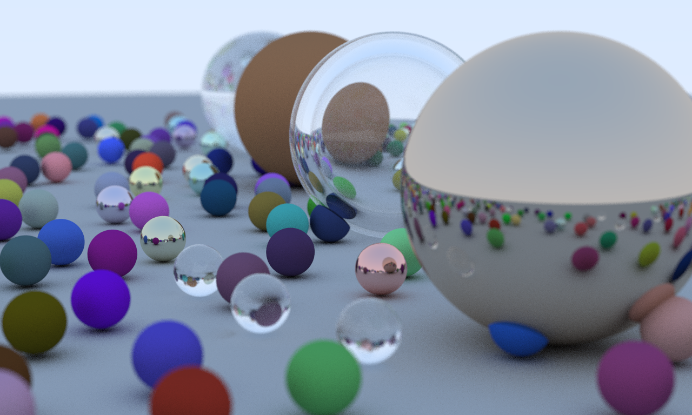
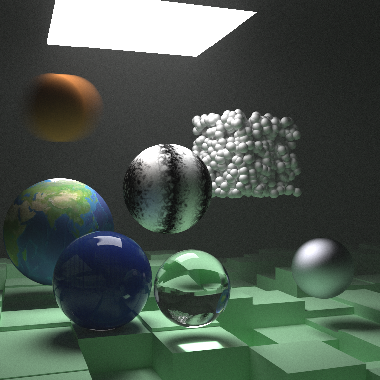
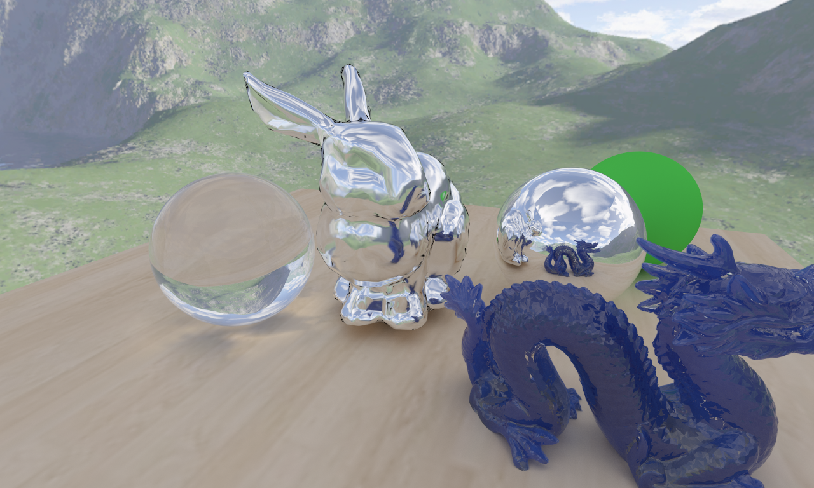
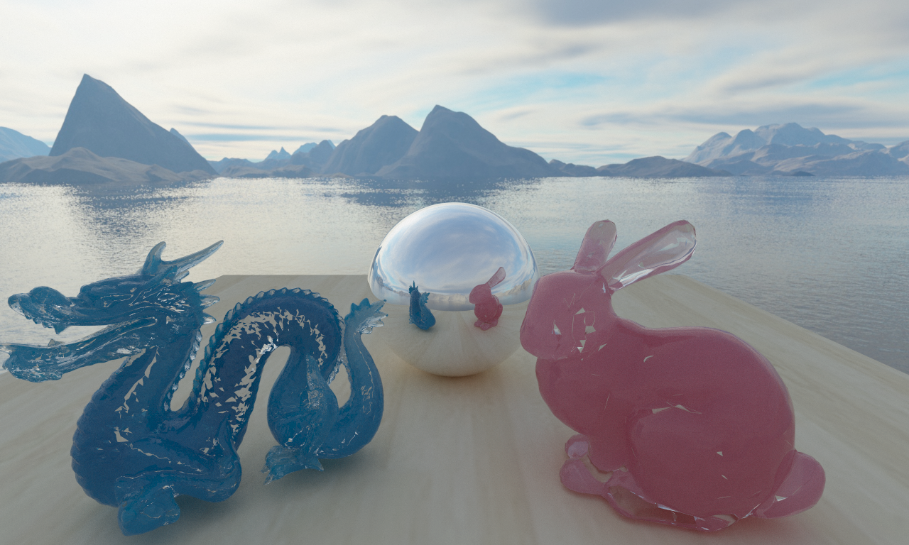

# 1. 简介

这是我对 光线追踪 的练习，内容基于

- Ray Tracing in One Weekend
- Ray Tracing the Next Week
- Ray Tracing the Rest of Your Life (暂时不写)

> 作者的源码网址
>
> https://github.com/petershirley/raytracinginoneweekend
>
> https://github.com/petershirley/raytracingthenextweek
>
> https://github.com/petershirley/raytracingtherestofyourlife

对内容进行了大量的修改，优化，新增

详细内容参考 notes 和 源码

图形接口使用的是 OpenGL

近日正在着手 **GPU的实现方案**

# 2. 代码框架

```
/01_in_One_Weekend
  -01_01_Image
  -01_02_Camera
  -01_03_Sphere
  -01_04_Group
  -01_05_Material
  -01_06_Scene
/02_the_Next_Week
  -02_01_MotionBlur
  -02_02_AABB
  -02_03_Texture
  -02_04_Light
  -02_05_TriMesh
  -02_06_Transform
  -02_07_Volume
  -02_08_All
/03_GPU_RayTracing
	(只有3_9，3_10 和 3_11可以运行，如需运行03_01-03_08，需要回退版本)
  -03_01_Basic
  -03_02_RayTracingBasicSystem
  -03_03_Material
  -03_04_GenData
  -03_05_BVH_Node
  -03_06_ImgTexture
  -03_07_Light
  -03_08_TriMesh
  -03_09_Transform
  -03_10_Volume
  -03_11_All
/04_Extension
  -04_01_Skybox
  -04_02_Model
  -04_03_GPU_Skybox_Model
  -04_04_GPU_Loop
/Utility
  /OpenGL
    -Camera
    -FBO
    -gal
    -Glfw
    -Mesh
    -Model
    -Shader
    -Texture
    -VAO
  /Other
    -ArgManager
    -Config
    -EventManager
    -File
    -Header: Array2D, GStorage, LStorage, Pool, Ptr, RandSet, Singleton, Vec
    -HeapObj
    -Image
    -Math: Math, Perlin
    -Operation: Operation, LambdaOp, InfoLambdaOp, OpQueue
    -Shape: Shape, Cube, Sphere
    -Timer
  /RayTracing
    -Hitable: AABB, BVH_Node, Group, Hitable, MoveSphere, Sky, Sphere, Transform, Triangle, TriMesh, Volume
    -ImgWindow: ImgWindow, TexWindow
    -Material: Dielectric, Lambertian, Material, Metal, OpMaterial
    -RayCamera: Ray, RayCamera, TRay, TRayCamera
    -RT_Texture: ImgTexture, OpTexture(Const, Checker, Noise), Texture
    -Scene
```

# 2. 使用方法

## 2.1 环境

- Visual Studio 2017+
- Windows10
- Git
- CMake（版本2.8以上）

## 2.2 下载代码

```bash
git clone https://github.com/Ubpa/RayTracingToy
```

## 2.3 编译

1. 建立工程

```bash
# 在 cmd 中运行如下命令
mkdir build
cd build
cmake .. -A Win32
```

2. 打开 `/build/RayTracingToy.sln` 
3. 在**解决方案中**的`CMakePredefinedTargets`中，右键`INSTALL`，点击生成

## 2.4 配置

在运行exe前，可以对 `config.out` 进行修改来配置，在调试时在 `config.in` 进行修改来配置

## 3. 出图

### 01_06_Scene



### 02_the_Next_Week_07_Volume


### 02_the_Next_Week_08_All



### Glass Cube


### 04_03_GPU_Skybox_Model



### 04_04_GPU_Loop

