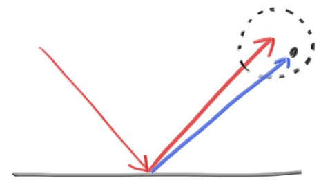
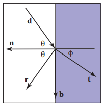
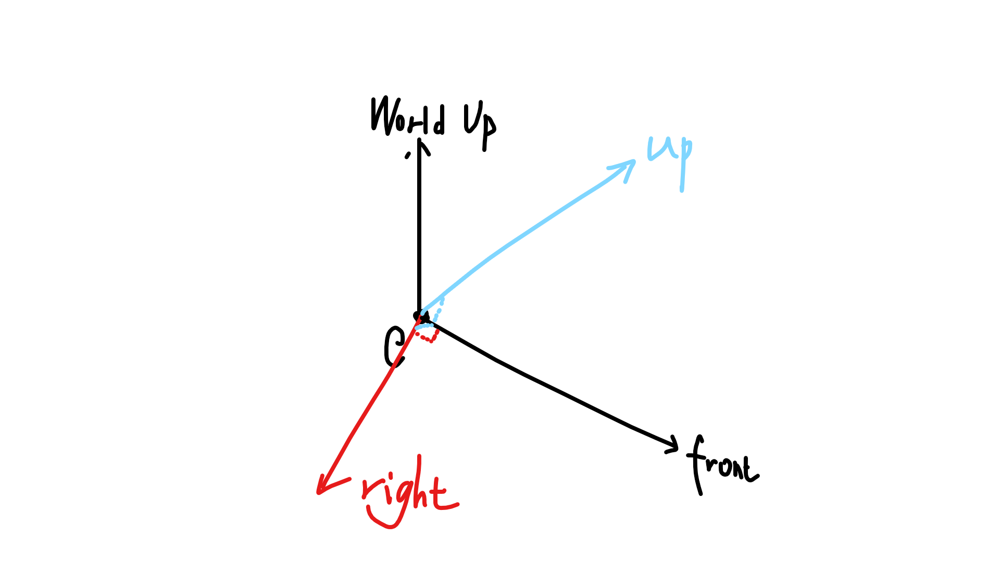
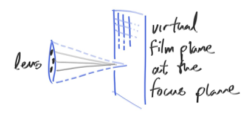

# 1. Ray Tracing in One Weekend

## 1.1 Output an Image

**PPM格式**

```
P3
# The P3 means colors are in ASCII, then 3 columns and 2 rows,
# width == 3, height == 2
# then 255 for max color, then RGB triplets
3 2
255
255	0	0
0	255	0
0	0	255
255	255	0
255	255	255
0	0	0
```

**图像库**

`ppm`格式以`ASCII`存储，文件较大，考虑采用图像的无损压缩格式`png`来存储图像。

可使用开源库 `stb_image` 和 `stb_image_write` 来读写图像

> https://github.com/nothings/stb

**图像实时显示**

如果只使用图像来检查结果，则需等待计算完毕；而光线追踪算法耗时较长，故考虑实时显示。

为了优化显示效果，增加了插值和高斯模糊。

图形接口使用的是OpenGL，我将功能封装在了 `Utility/RayTracing/ImgWindow` 中。

**示例**

```c++
int main(int argc, char ** argv) {
	ImgWindow imgWindow(str_WindowTitle);
	Image & img = imgWindow.GetImg();
	const size_t val_ImgWidth = img.GetWidth();
	const size_t val_ImgHeight = img.GetHeight();
	const size_t val_ImgChannel = img.GetChannel();

	auto imgUpdate = Operation::ToPtr(new LambdaOp([&]() {
		static int f = 0;
		for (size_t i = 0; i < img.GetWidth(); i++) {
			for (size_t j = 0; j < img.GetHeight(); j++) {
				float r = 0.5 * i / (float)img.GetWidth();
				float g = 0.5 * j / (float)img.GetHeight();
				float b = 0.2 + 0.2*sinf(0.01f * f);
				img.SetPixel(i, j, Image::Pixel<float>(r, g, b));
			}
		}
		f++;
	}));

	imgWindow.Run(imgUpdate);

	return 0;
}
```

结果输出在 `data/out` 中

图像的(0,0)在左上角，右为x轴，下为y轴

OpenGL中，图像的(0,0)在左下角，右为x轴，上为y轴

故需要调整图像起点

## 1.2 光线，相机

**光线**

不同于书，我给射线定义了颜色和`tMax`

在遇到光源前，颜色的物理意义是衰减；在遇到光源后，该值即为该光线到达相机的颜色。

`tMax` 指示了光所能到达的最远处，在与 `hitable`(后面的概念) 进行碰撞检测时更新

**相机**

相机朝向像平面的中心，相机的位置处于焦点处

相机到成像平面的距离为焦距

相机的右轴为像平面的横轴，相机的上轴为像平面的纵轴

## 1.3 球

**相交**
$$
|\mathbf{P}-\mathbf{C}|=R\\
\mathbf{P}=\mathbf{A}+t\mathbf{B}\\
(t\mathbf{B}+\mathbf{A}-\mathbf{C})^2=R^2\\
|\mathbf{B}|^2t^2+2\ dot(\mathbf{B},\ \mathbf{A}-\mathbf{C})\ t+|\mathbf{A}-\mathbf{C}|^2-R^2=0
$$

## 1.4 材质

**漫反射**


**镜面反射**




**折射**

Snell's Law
$$
n\sin\theta=n_t\sin\phi
$$
则有
$$
\cos^2\phi=1-\frac{n^2(1-\cos^2\theta)}{n_t^2}
$$

$$
\mathbf{t}=\mathbf{b}\sin\phi-\mathbf{n}\cos\phi\\
\mathbf{d}=\mathbf{b}\sin\theta-\mathbf{n}\cos\theta\\
\mathbf{b}=\frac{\mathbf{d}+\mathbf{n}\cos\theta}{\sin\theta}
$$
因此可得
$$
\begin{align*}
\mathbf{t}&=\frac{n(\mathbf{d}+\mathbf{n}\cos\theta)}{n_t}-\mathbf{n}\cos\phi\\
&=\frac{n(\mathbf{d}+\mathbf{n}(-\mathbf{d}\cdot\mathbf{n}))}{n_t}-\mathbf{n}\sqrt{1-\frac{n^2(1-(\mathbf{d}\cdot\mathbf{n})^2)}{n_t^2}}\\
\end{align*}
$$
当根号下的值为负数时为**全反射** 

折射的同时会有反射，反射率遵循 Fresnel equations。一个好的近似是 Schlick approximation，公式为
$$
R(\theta)=R_0+(1-R_0)(1-\cos\theta)^5\\
R_0=(\frac{n_t-1}{n_t+1})^2
$$
上边的 $\cos \theta$ 永远是空气中的角

另外，光在穿过时会发生颜色衰减，遵循 Beer's Law
$$
\begin{align*}
dI&=-CIdx\\
I&=ke^{-Cx}\\
I(0)&=I_0\\
I(1)&=aI(0)\\
I(s)&=I(0)e^{\ln(a)s}
\end{align*}
$$

## 1.5 相机



## 1.6 景深



透镜半径越大，非焦平面附近的物体就会越模糊


