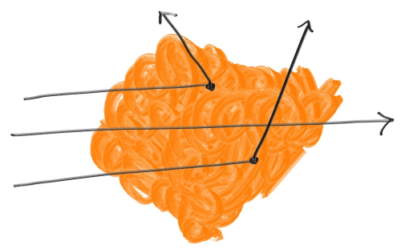

# 2. Ray Tracing: The Next Week

## 2.1 Motion Blur

让 相机、光线、物体 带有时间的概念

## 2.2 BVH

**步骤**

1. 每次分割选取一个维度，该维度为所有维度中**空间离散度**(即中心点的在那一维度的方差)最大的一维。
2. 在所选维度对物体进行排序(根据他们的中心点)
3. 分成两半，放入左子树和右子树

**光线与包围盒相交**

```c++
bool AABB::Hit(const Ray::Ptr & ray) const {
	if (!IsValid())
		return false;

	const vec3 origin = ray->GetOrigin();
	const vec3 dir = ray->GetDir();
	float tMin = Ray::tMin;
	float tMax = ray->GetTMax();
	for (size_t i = 0; i < 3; i++) {
		float invD = 1.0f / dir[i];
		float t0 = (minP[i] - origin[i]) * invD;
		float t1 = (maxP[i] - origin[i]) * invD;
		if (invD < 0.0f)
			std::swap(t0, t1);

		tMin = max(t0, tMin);
		tMax = min(t1, tMax);
		if (tMax <= tMin)
			return false;
	}
	return true;
}
```

**相交策略**

```c++
HitRst BVH_Node::RayIn(Ray::Ptr & ray) const {
	if (!box.Hit(ray))
		return false;

	HitRst hitRstLeft = left != NULL ? left->RayIn(ray) : HitRst::FALSE;
	HitRst hitRstRight = right != NULL ? right->RayIn(ray) : HitRst::FALSE;

	//先进行左边的测试, 则测试后 ray.tMax 被更新(在有碰撞的情况下)
	//此时如果 hitRstRight 有效, 则可知其 ray.tMax 更小
	//故只要 hitRstRight 有效, 则说明 right 更近
	if (hitRstRight.hit)
		return hitRstRight;
	else if(hitRstLeft.hit)
		return &hitRstLeft;
	else
		return HitRst::FALSE;
}
```

## 2.3 Perlin Noise

```c++
class Perlin {
public:
	static float Noise(const glm::vec3 & p);
	static float Turb(const glm::vec3 & p, size_t depth = 7);
private:
	static float PerlinInterp(const glm::vec3 c[2][2][2], float u, float v, float w);
	static std::vector<size_t> GenPermute(size_t n);
	static std::vector<glm::vec3> GenRandVec(size_t n);

	static std::vector<glm::vec3> randVec;

	// 0, 1, ... , 255 变更顺序后的序列
	static std::vector<size_t> permuteX;
	static std::vector<size_t> permuteY;
	static std::vector<size_t> permuteZ;
};
```

```c++
float Perlin::Noise(const vec3 & p){
	// pf 为小数部分
	vec3 pf = p - floor(p);
	// pi 为整数部分
	ivec3 pi = floor(p);
	// 8个位置的向量
	// 单位立方体8个顶点, 每个顶点一个随机向量
	vec3 c[2][2][2];
	for (int dx = 0; dx < 2; dx++) {
		for (int dy = 0; dy < 2; dy++) {
			for (int dz = 0; dz < 2; dz++) {
				size_t idx = permuteX[(pi.x + dx) & 255]
					^ permuteY[(pi.y + dy) & 255]
					^ permuteZ[(pi.z + dz) & 255];
				c[dx][dy][dz] = randVec[idx];
			}
		}
	}
	return PerlinInterp(c, pf.x, pf.y, pf.z);
}

float Perlin::PerlinInterp(const vec3 c[2][2][2], float u, float v, float w) {
	float uu = u * u*(3 - 2 * u);
	float vv = v * v*(3 - 2 * v);
	float ww = w * w*(3 - 2 * w);
	float sum = 0;
	for (size_t i = 0; i < 2; i++) {
		for (size_t j = 0; j < 2; j++) {
			for (size_t k = 0; k < 2; k++) {
				// 顶点 到 插值点 的向量
				vec3 weightVec(u - i, v - j, w - k);
				// 权值 为 插值点 到 [顶点对角] 的 xyz轴向 的 距离(非负) 的乘积
				//vec3 absWeightVec = abs(vec3(u-(1-i),v-(1-j),w-(1-k)));
				//float weight = absWeightVec.x * absWeightVec.y * absWeightVec.z;
				float weight = (i*uu + (1 - i)*(1 - uu))
					* (j*vv + (1 - j)*(1 - vv))
					* (k*ww + (1 - k)*(1 - ww));
				// 加权求和, 项为点乘, 从而达到了最值转移的作用(不在整数点上)
				sum += weight * dot(c[i][j][k], weightVec);
			}
		}
	}
	return sum;
}

float Perlin::Turb(const vec3 & p, size_t depth){
	float sum = 0;
	vec3 curP = p;
	float weight = 1.0;
	for (size_t i = 0; i < depth; i++) {
		sum += weight * Noise(curP);
		// weight = pow(0.5, i);
		weight *= 0.5;
		// curP = p * pow(2, i);
		curP *= 2;
	}
	//float abs --> fabs
	return fabs(sum);
}

vector<size_t> Perlin::GenPermute(size_t n) {
	vector<size_t> rst(n);
	for (size_t i = 0; i < n; i++)
		rst[i] = i;

	Math::Permute(rst);
	return rst;
}

vector<vec3> Perlin::GenRandVec(size_t n) {
	vector<vec3> rst(n);
	for (size_t i = 0; i < n; ++i)
		rst[i] = RandInSphere();

	return rst;
}


vector<vec3> Perlin::randVec = Perlin::GenRandVec(256);
vector<size_t> Perlin::permuteX = Perlin::GenPermute(256);
vector<size_t> Perlin::permuteY = Perlin::GenPermute(256);
vector<size_t> Perlin::permuteZ = Perlin::GenPermute(256);
```

## 2.4 Light

```c++
bool Light::Scatter(HitRecord & rec) const {
    vec3 color = lightTex->Value(rec.vertex.u, rec.vertex.v, rec.vertex.pos);
	rec.ray->SetLightColor(color);
	return false;
}
```

## 2.5 TriMesh

为了能够实现高灵活度的物体，自行编写了关于三角网格的模块

首先是三角形，然后三角网格继承自`BVH_Node`，可以达到对复杂模型快速确定其中一个三角形的目的

### 2.5.1 Triangle

三角形有三个顶点，每个顶点具有一些属性，如法向、参数坐标等。当光线与三角形相交时，需要计算出相交处的法向、参数坐标等。

**Ray-Triangle Intersection**
$$
\mathbf{e} + t\mathbf{d} = \mathbf{f}(u, v)= \mathbf{a} + β(\mathbf{b} − \mathbf{a}) + γ(\mathbf{c} − \mathbf{a})
$$

因此
$$
β(\mathbf{a} − \mathbf{b})+γ(\mathbf{a} − \mathbf{c})+ t\mathbf{d}=\mathbf{a}-\mathbf{e}
$$

这是一个线性方程，可以求解出 $\beta$, $\gamma$ 和 $t$，从而 $\alpha=1-\beta-\gamma$，如果 $0\le\alpha,\beta,\gamma\le1$ 且 $tMin < t <tMax$，则相交。

**三角线性插值**
$$
\mathbf{n}=\alpha\mathbf{n_A}+\beta\mathbf{n_B}+\gamma\mathbf{n_C}
$$

### 2.5.2 TriMesh

简单继承于 `BVH_Node` 即可

## 2.6 Transform

有了`TriMesh`，那么我们就能实现很多模型了。接下来自然就要考虑模型的旋转，缩放，平移的问题了。因此我自行编写了 Transform 模块。

核心思想很简单，就是对光线进行一个逆变换，与模型交互，然后再将光线变换回来，另外在将碰撞信息也进行变换

```c++
HitRst Transform::RayIn(Ray::Ptr & ray) const {
	ray->Transform(inverse(transform));
    
	auto hitRst = hitable->RayIn(ray);
	if (hitRst.hit)
		hitRst.record.vertex.Transform(transform);
	
	ray->Transform(transform);
	
	return hitRst;
}
```

其中对光线的变换如下

```c++
void Ray::Transform(const mat4 & transform) {
	dir = mat3(transform) * dir;
	auto originQ = transform * vec4(origin, 1.0f);
	origin = vec3(originQ) / originQ.w;
}
```

对顶点的变换如下

```c++
void Vertex::Transform(const mat4 & transform) {
	auto posQ = transform * vec4(pos,1.0);
	pos = vec3(posQ) / posQ.w;
	normal = normalize(transpose(inverse(mat3(transform))) * normal);
}
```

## 2.7 Volumes

光线在一个物质内部会发生随机的反射



反射的遵循的规律为
$$
dP=C*dL
$$
考虑事件：**光线经过 $L$ 长度而不发生反射**

其概率为
$$
P=\lim\limits_{n\to\infty}(1-C\frac{L}{n})^n=e^{-CL}
$$
则有
$$
L=-\frac{\ln P}{C}
$$
在实现时需要特别注意光线在体积内的长度

> 现在实现中存在一个错误，就是当一个模型经过Transform发生了缩放时，上述长度并没有去考虑这一点，规避的方法就是Transform不进行缩放