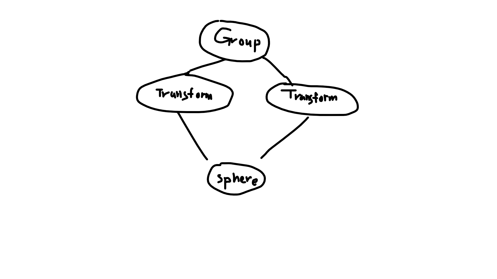

# 基于 OpenGL 的 GPU 光线追踪

前端时间看了 *Peter Shirley* 的 *Ray Tracing in One Weeken* 和 *Ray Tracing: the Next Week*，作者很轻松的就实现了一个光线追踪渲染器。我依照课本原理，用 C++ 也写了同样的光线追踪程序。

作者已经将这两本书免费公开了，在 [RTR 官网](http://www.realtimerendering.com/)上有提供下载链接

除此之外，我自己还增添了 `Triangle`，`Mesh`，`Skybox`，`Transform`，`Model` 等以丰富渲染器的功能。

之前跟过教程 [LearnOpenGL](https://learnopengl-cn.github.io/)，所以这个渲染器的出图我是用 OpenGL 显示的。

最近 NVIDIA 也发布了 RTX 新系列显卡，说明实时光线追踪已经到了可以商用的地步了。

对此很感兴趣，又恰好我在写 CPU 光线追踪的渲染器。自然而然就想着在 GPU 端实现。

既然对 OpenGL 比较熟练，所以不如就 基于OpenGL 来初步尝试下 GPU 光线追踪 好了。

看到了 DX12 光线追踪管线


很明显，这张图基本描述了光线追踪的流程。

既然业界就这么做，那么我就放心按自己的想法写了。

## 1. 思路

在 shader 里边写光线追踪，有些奇妙。

编写过程中真是一堆麻烦。下面一一阐述吧。

### 1.1 随机数

GLSL 没有提供随机数函数。本着能用就行的思想，我找到的第一个跟随机数有关的函数如下

 ```c++
// 返回值 [0.0f, 1.0f)
float RandXY(float x, float y){
    return fract(cos(x * (12.9898) + y * (4.1414)) * 43758.5453);
}
 ```

那好，我们以此来制定符合要求的随机数函数。要求一句话概括就是不能重复，每个fragment，每个sample，每次调用都要不一样。

> 一个像素会计算多个 Sample 以降噪

为此，制定的随机数函数如下

```c++
// 返回值 [0.0f, 1.0f)
float Rand(){
	float a = RandXY(TexCoords.x, rdSeed[0]);
    float b = RandXY(rdSeed[1], TexCoords.y);
    float c = RandXY(rdCnt++, rdSeed[2]);
    float d = RandXY(rdSeed[3], a);
    float e = RandXY(b, c);
    float f = RandXY(d, e);

    return f;
}
```

`rdSeed` 是 `Uniform`，每次 sample都改变。因为函数里边包括 `rdCnt`, `TexCoords`, `rdSeed`，显然满足了要求。

### 1.2 光线计算任务的分配

考虑到 fragment shader 的特点，即每个 fragment shader 负责一个像素。

那么，很自然我们会把位于同一像素的光线都交给处于这个像素的 fragment shader 来计算。

这样，调用一次 shader，就可以将整个屏幕的像素都计算一个 sample，多次调用就得到多个 Sample。

### 1.3 数据传输方式

fragment shader 里边有 4 种方式可以获取数据

- const 数组
- Uniform
- in
- texture

因为数据并不是顶点数据，而是更为复杂的场景数据，所以排除 in

早期我采用了 const 数组，但是场景数据稍微一大，编译就报错了，提示空间不足

然后改用 uniform 数组，同样还是提示空间不足。

因此只好使用 texture。因为我想要的只是一个可以放数据的数组，所以我用的是一个 width 为数据长度， height 为 1 的 texture 来存放场景数据。

但是场景再大些，数组长度达到了几十万时，又发生了错误。OpenGL不支持 width 有几十万这么大。

多次试错之后，终于采取了最为合理的 正方形 texture 来存数据

> 一个2048*2048 4通道 的texture可以存 1677w 个 float，这下总够了

这里我把数据分为两种，一种是描述场景组织的，这种数据每次只需要取一个float，因此我用单通道的texture来存放。另一种是大块数据，如矩阵，顶点数据等，我将其放在了四通道的texture里，这样可以减少纹理采样次数。

```c++
float At(sampler2D data, float idx){
	float row = (idx+0.5)/textureSize(data, 0).x;
	float y = (int(row)+0.5)/textureSize(data, 0).y;
	float x = (idx + 0.5 - int(row) * textureSize(data, 0).x)/textureSize(data, 0).x;
    vec2 texCoords = vec2(x, y);
    return texture2D(data, texCoords).x;
}

void GetPack(float idx, out vec4 pack){
	float row = (idx+0.5)/textureSize(PackData, 0).x;
	float y = (int(row)+0.5)/textureSize(PackData, 0).y;
	float x = (idx + 0.5 - int(row) * textureSize(PackData, 0).x)/textureSize(PackData, 0).x;
    vec2 texCoords = vec2(x, y);
	pack = texture2D(PackData, texCoords);
}
```

### 1.4 场景数据

GLSL 是类C语言的一种编程语言。并没有类的概念。因此我们需要手动实现类，以适应场景的各种复杂需要。

思路很简单，就是每个数据块的开头，用一个 float 标明类型，比如 Sphere 是 0，Group是 1等。得到类型后再交由相关函数来解析数据即可。

### 1.5 递归展开

GLSL 不支持递归函数，当然也不支持循环调用（如A调用B，B调用A）

这带来了很大的麻烦，因为光线追踪（准确的说是路径追踪）的基本思想就是递归。

当然没了递归我们还可以考虑递归展开。

场景是一颗树（准确的说是有向无环图），因此我们的任务就是树的非递归遍历。

要递归展开就以为着需要一个数组来作为栈存放数据。而栈越大，fragment shader 的运行速度就越慢。

因此我们并不能胡乱利用宝贵的栈资源。

我在此做了大量的优化，找到了一个非常合理的结构。

#### 1.5.2 指针

GLSL 没有指针。不过指针的原理就是一个地址，等价于一个数组下标索引。

回想一下数组实现的链表，差不多就那个意思。后边说指针意思都是下标索引。

#### 1.5.1 栈中存放节点

非递归展开大家很快就能想到的思路是

```
循环 {
	出栈
	处理该节点
	将节点的所有子节点入栈
}
```

这样栈的空间复杂度是 `O(bd)`，其中 b 为宽度，d 为深度

其实我们只入栈一个子节点指针，然后通过该子节点指针找到父节点的下一个子节点指针。如果其为非法指针，则

这样就将空间复杂度降为了 `O(d)`。

#### 1.5.2 离开父节点

有些节点，比如 Transform，需要在离开该节点时对光线做变换。那么我们就需要在访问到上述非法指针后返回父节点，以执行父节点的操作。

很自然我们会想到在入栈子节点时，先把父节点指针先入栈，这样就可在访问非法指针时出栈获取父节点指针。

为了节省栈空间，考虑到指针的下标索引，为非负数，那么我们可以将非法指针设置为父节点指针的负数。从而不再需要将父节点指针压栈

综上，一个典型的 Group节点 在空间中的格式如下

```c++
struct Group{
    float type = 1.0;
    //... 其他数据
    float children[n];
    float childrenEnd = - this;
}
```

#### 1.5.3 光线与碰撞结果

对于光线遍历整个场景以计算最近的碰撞，虽然CPU的实现中在遍历过程中不断创建ray，record。但实际上全程只需要一个record和ray，而遍历时只需要更新 ray 的 tMax 和 record即可。因此递归展开时并不需要对 ray 和 record 进行压栈。

## 2. 场景数据生成

上边只提到存放场景数据的位置（texture），现在来说说场景数据应该如何生成。

通过分析，其实，场景的所有结点总共就两类

- 一类是可以在树的枝节点，包括 `Group`，`Transform`，`BVH_Node`，`TriMesh`，`Model` ，`Volume` 等，特征是其含有孩子节点。

- 另一类是树的叶子节点，包括 `Sphere` 和 `Triangle`

所以，虽然节点五花八门，但其实具有很大的共性

数据的生成，就以遍历树的方式生成

这里考虑使用访问者模式

```c++
class HitableVisitor {
public:
	virtual void Visit(const Hitable * sphere);
	virtual void Visit(const Sphere * sphere);
	virtual void Visit(const Sky * sky);
	virtual void Visit(const MoveSphere * moveSphere);
	virtual void Visit(const Triangle * triangle);
	virtual void Visit(const Transform * transform);
	virtual void Visit(const Volume * volume);
	virtual void Visit(const Group * group);
	virtual void Visit(const BVH_Node * bvhNode);
	virtual void Visit(const TriMesh * triMesh);
	virtual void Visit(const Model * model);
};
```

> 作者在书中将节点写作 Hitable，是因为各个节点都会实现一个 碰撞函数。
>
> 其实我们完全可以把 碰撞 这个逻辑拿出来，用访问者模式来实现一个碰撞检测器
>
> 而 hitable 就可以退化为只描述场景的 node 了

用例子来说明比较简单，场景如下



这个场景，对应的场景数据为

```c++
Type_Group(1), child0(4), child1(28), -this(-0),//@3
Type_Transform(2), matrixData(16 float), child0(23), -this(-4),//@22
Type_Sphere(0), center(3 float), radius,//@27
Type_Transform(2), matrixData(16 float), child0(23), -this(-28)//@46
```

## 3. Shader 主要实现

### 3.1 伪代码

```c++
out vec3 out_SumColor;

uniform sampler2D SumColor;
uniform sampler2D data;

void main(){
    Ray ray = GenRay();
    out_SumColor = SumColor + RayTracer(ray);
}

// @1 根据参数坐标由照相机生成的初始光线
// @return color
vec3 RayTracer(Ray ray){
        while(true){
        HitRst hitRst = RayIn_Scene(ray);
        if(hitRst.hit){
            if(!Scatter(hitRst, ray))
                return ray.color;
        }else
            return vec3(0);
    }
}

HitRst RayIn_Scene(Ray ray){
    Stack_Push(1);
    HitRst finalHitRst;
    while(! Stack_Empty()){
        pIdx = Stack_Pop();
        idx = data[pIdx];
        if(idx<=0){
            idx = -idx;
            type = data[idx];
            if(type == Type_Group)
                //...
            else if(type == Type_Transform)
                //...
            else
                //...
        }
        
        Stack_Push(pIdx+1);
        type = data[idx];
        if(type == Type_Group)
            //...
        else if(type == Type_Transform)
            //...
        else if(type == Type_Sphere)
            //...
        else
            //...
    }
    return finalHitRst;
}

bool Scatter(HitRst hitRst, ray){
    //...
}
```

### 3.2 栈内数据示例

以上边的场景为例

> 初始：栈内有1
>
> 循环1：取出1，data[1]为4，合法，入栈2(1+1)，data[4]为Transform，变换光线，入栈21(4+17)
>
> 循环2：取出21，data[21]为23，合法，入栈22(21+1)，data[23]为Sphere，碰撞计算
>
> 循环3：取出22，data[22]为-4，非法，取正得4，data[4]为tranform，变换回光线
>
> 循环4：取出2，data[2]为28，合法，入栈3(2+1)，data[28]为Transform，变换光线，入栈45(28+17)
>
> 循环5：取出45, data[45]为23，合法，入栈46(45+1)，data[23]为Sphere，碰撞计算
>
> 循环6：取出46, data[46]为-28，非法，取正得28，data[28]为tranform，变换回光线
>
> 循环7:  取出3，data[3]为-0，非法，取正得0，data[0]为group，无操作
>
> 循环8: 栈为空，场景遍历完毕

## 4. 总结

有了以上框架，想实现具体功能只是时间问题和细节问题了（Volume比较难）

感兴趣的可以到我的github上看

https://github.com/Ubpa/RayTracingToy

谢谢大家的阅读