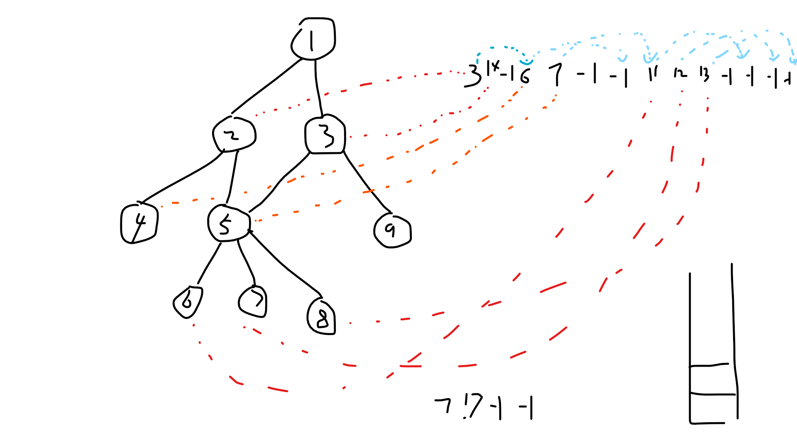

#### 3. GPU_RayTracing

## 3.1 基本思路框架

### 3.1.1 概念理解

- Uniform：此为全局变量，可以在shader里更改，也可在CPU端更改
- shader文件变量：就是一个shader里，写在main之外的变量，该变量对其所在文件可见，CPU不可更改
- 动态shader：动态地编写shader，可利用此特性实现CPU写入shader文件变量
- 纹理：一个shader可获取的存储大量数据的方式。既可以存储像素数据，也可以将其视为纹理，然后再通过解析的方式转换成需要的数据对象

### 3.1.2 基本思路

按照光线追踪的时间顺序来思考如何实现

#### 3.1.2.1 随机数

glsl没有随机数相关的接口，所以需要自己生成。

需求是每一次渲染每一个像素里的每一个随机数都不相同，所以需要引入4个变量

- 渲染次数相关变量：可以在CPU端设置Uniform，用了4个随机数 `rdSeed[4]`
- 像素相关变量：纹理坐标 `TexCoords`
- 同帧同像素多次获取相关变量：获取计数 `rdCnt`

随机数能用就行，就网上随便找了一个

```c++
// 返回值 [0.0f, 1.0f)
float RandXY(float x, float y){
    return fract(cos(x * (12.9898) + y * (4.1414)) * 43758.5453);
}
```

因此我们可以定制我们需要的随机数函数，如下

```c++
// 返回值 [0.0f, 1.0f)
float Rand(){
	float a = RandXY(TexCoords.x, rdSeed[0]);
    float b = RandXY(rdSeed[1], TexCoords.y);
    float c = RandXY(rdCnt++, rdSeed[2]);
    float d = RandXY(rdSeed[3], a);
    float e = RandXY(b, c);
    float f = RandXY(d, e);

    return f;
}
```

有了这个随机数函数，那么我们就可以实现其他的随机函数了，包括

- `RandInSquare`
- `RandInCube`

- `RandInCircle`
- `RandInSphere`

#### 3.1.2.2 生成光线

**① 相机参数**

相机参数是不会变的，所以可以在CPU端计算出各相机参数，然后在使用Uniform传给Shader

**② 函数实现与数据管理**

`RayCamera`生成光线的函数如下

```c++
Ray::Ptr GenRay(float s, float t){
	auto ray = ToPtr(new Ray);
    vec2 rd = lenR * Math::RandInCircle();
	vec3 origin = pos + rd.x * right + rd.y * up;
	vec3 dir = BL_Corner + s * horizontal + t * vertical - origin;
	ray->Init(origin, dir);
}
```

其中 `(s,t) = TexCoords + RandInSquare` 

计算容易实现，难的地方在于如何管理光线数据

这里考虑使用 texture。我们来看一个光线所需的数据有

	glm::vec3 origin;
	glm::vec3 dir;
	glm::vec3 color;
	float tMax;
	float time;
另外暂时考虑到每个像素内部还需要知道剩余多少条光线需要产生，因此这里增加一个 `curRayNum` 的变量

此外，还需要知道该光线的深度，这里想到可以利用概率的形式来描述

假设 以概率 p 继续追踪，则深度期望为
$$
\begin{aligned}
E &= \sum_{i=0}^\infty{i*p^i(1-p)}\\
  &= （1-p)*\sum_{i=0}^\infty{i*p^i}\\
  &= \frac{p}{1-p}
\end{aligned}
$$
令`E=50`，则`P=50/51`

故总共12个变量，可以放在3张 `texture` 里，简单安排如下

```
texture0: origin, curRayNum
texture1: dir, tMax
texture2: color, time
```

在shader里解析完数据后，放到struct里

因为这些数据需要读也需要写，因此需要两个buffer，一个读一个写，然后每一帧互换读写身份，类似之前的实现blur用到的pingpong算法。

当光线追踪完毕后，需要写颜色数据，这里也同样需要两个buffer

#### 3.1.2.3 场景数据

这个非常困难，因为CPU端我们使用数据结构来实现，而glsl是没有类的，只有struct

要考虑的东西很多，包括

```
AABB
BVH_Node
Group
Hitable
MoveSphere
Sky
Sphere
Transform
Triangle
TriMesh
Volume
```

为了简化，初步只考虑 `Sphere`， `Triangle`，之后再来考虑 `AABB` 和 `BVH_Node`

考虑使用统一的数据结构，即 `float*`，第一个float用于指出结点类型，根据结点类型来解析之后的float类型的数据，利用这种数据的代码如下

```c++
int curIdx = 0;
HitRst closestRst;
for(int i=0; i<n; i++){
    int type = data[curIdx];
    HitRst hitRst;
    if(type == 0)
        hitRst = Sphere(curIdx, ray);
    else if(type == 1)
        hitRst = Triangle(curIdx, ray);
    //...(其他类型)
    
    // Update closestRst, curIdx
}
```

这样也易于扩展

考虑细节

- 空间：可以使用shader里的const float数组，故需要用到动态生成shader的技术

- 填充：初步先手动填充，更一般的做法是 访问者模式，但实现起来较为麻烦，也不是很有必要

#### 3.1.2.4 材质

材质的实现方法类似场景数据

#### 3.1.2.5 Fragment Shader

```c++
Ray ray = DecodeRay(TexCoords);
HitRst finalRst;
int curIdx = 0;
for(int i=0; i<n; i++){
    int type = data[curIdx];
    HitRst hitRst;
    if(type == 0)
        hitRst = Sphere(curIdx, ray);
    else if(type == 1)
        hitRst = Triangle(curIdx, ray);
    //...(其他类型)
    
    // Update finalRst, curIdx
}
if(finalRst.hit){
    RayOutRst rayOutRst = RayOut(mat[finalRst.matIdx]);
    if(rayOutRst.hitLight)
    	WriteColor(TexCoords, ray.color);
    else
        WriteRay(TexCoords, ray);
}else
    WriteColor(TexCoords, vec3(0));
```

## 3.2 Basic

```c++
shader

buffer[2];//pingpong, 每个buffer有3个rgba32f和1个rgb32f, 16bit 精度不够

n time : raytracingShader
show curRst
```

## 3.3 RayTracingSystem

### 3.3.1 随机数

```c++
float RandXY(float x, float y);
float Rand(vec2 TexCoords, float frameTime, int rdCnt);
vec2 RandInSquare();
vec3 RandInCube();
vec2 RandInCircle();
vec3 RandInSphere();
```

### 3.3.2 数学函数

```c++
float atan2(float y, float x);
vec2 Sphere2UV(vec3 normal);
```

### 3.3.3 相机

```c++
struct Camera{
    vec3 pos;
    vec3 BL_Corner;
    vec3 horizontal;
    vec3 vertical;
    vec3 right;
    vec3 up;
    vec3 front;
    float lenR;
    float t0;
    float t1;
};
```

### 3.3.4 光线

```c++
struct Ray{
    vec3 origin;
    vec3 dir;
    vec3 color;
    float tMax;
    float curRayNum;
};
```

### 3.3.5 漫反射

```c++
struct Lambertian{// 4
    float type = 0.0f;
    vec3 color;
};
```

### 3.3.6 球

```c++
struct Sphere{// 6
    float type = 0.0f;
    float matIdx;
    vec3 center;
    float radius;
};
```

## 3.4 Material

### 3.4.1 Metal

```c++
struct Metal{// 5
    float type = 1.0;
    vec3 color;
    float fuzz;
};
```

### 3.4.2 Dielectric

不再实现其中的attenuation，原因是`attenuationConst`参数不好设置，一般其总是`(0,0,0)`，这样就浪费了计算资源。后边可通过Volume的方式模拟玻璃有颜色的类似效果。

**相关函数**

```c++
// 反射率
// viewDir 为 视线方向(从物点到视点的方向)
// halfway 为 视线方向与光线方向的平均
// rationNtNi 折射率之比 == Nt / Ni
//     Ni 为 入射光线所在介质的折射率
//     Nt 为 折射光线所在介质的折射率
float FresnelSchlick(const glm::vec3 & viewDir, const glm::vec3 & halfway, float ratioNtNi);
```

**数据结构**

```c++
struct Dielectric{// 2
    int type = 2;
    float refractIndex;
};
```

## 3.5 Fragment Shader Generator

为了达到程序生成场景、材质的目的，需要 CPU 来生成Shader。

故考虑实现一个 Shader Generator

### 3.5.1 数据大小

#### 3.5.1.1 物体

```c++
struct Hitable{// 2
    float matIdx;
    bool isMatCoveralbe;
}

struct Sphere{// 7
    int type = 0;
    struct Hitable;
    vec3 center;// @3
    float radius;
};

struct Group{// 4 + childrenNum
    int type = 1;
    struct Hitable;
    int childrenNum;// @3
    int childrenIdx[childrenNum];
}
```

#### 3.5.1.2 材质

```c++
struct Lambertian{// 2
    int type = 0;
    int texIdx;
}

struct Metal{// 3
    int type = 1;
    int texIdx;
    float fuzz;
}

struct Dielectric{// 2
    int type = 2;
    float refractIndex;
}
```

#### 3.5.1.3 纹理

```c++
struct ConstTexture{// 4
    int type = 0;
    vec3 color;
}
```

### 3.5.2 访问者模式

生成数据需要遍历场景收集Hitable、Material 和 Texture的数据，故考虑使用访问者模式

```c++
sceneHitable->Accept(hitableVisitor);//收集Hitable的数据和涉及的Material
hitableVisitor->Accept(matVisitor);//访问hitableVisitor中的Material
matVisitor->Accept(texVisitor);//访问materialVisitor中的Texture
```

### 3.5.3 RayIn 递归问题

GLSL 不允许函数发生递归（循环调用）。故需要采取“递归展开”技术。

场景，总的来说是一棵节点树，叶子结点是可绘制体（`Sphere`、`Triangle`），而中间节点是`Group`、`BVH_Node`、`TriMesh`。搜索过程是深度搜索。

所以这里的递归展开其实就是对一个多叉树进行栈展开（如果是广度搜索就是采用队列）。

栈展开时需要 `Push` 子节点的指针，前边提到在GLSL中没有指针，相对应的是数组下标。

每次与可绘制体进行碰撞检测时，如果发生碰撞，则说明 `Ray` 的 `tMax` 更小，则直接更新 `finalHitRst`。故，只需要保存 `finalHitRst` 即可。虽然当前只有 `Sphere` 和 `Group`，但两者具有代表性，之后扩展 `Triangle` 、`BVH_Node`、`TriMesh` 也是没有问题的。

```c
struct HitRst RayIn_Scene(){
    int idxStack[100];
    int idxStackSize = 0;
    struct HitRst finalHitRst = HitRst_InValid;
    
    idxStack[idxStackSize++] = 0;
    while(idxStackSize > 0){
        int idx = idxStack[--idxStackSize];
        
        int type = int(SceneData[idx]);
        if(type == HT_Sphere){
            struct HitRst hitRst = RayIn_Sphere(idx);
            if(hitRst.hit)
                finalHitRst = hitRst;
        }
        else if(type == HT_Group){
            int childrenNum = int(SceneData[idx+3]);
            for(int i=0; i < childrenNum; i++)
                idxStack[idxStackSize++] = int(SceneData[idx+4+i]);
        }
        //else
        //    ;// do nothing
    }
    
    return finalHitRst;
}
```

### 3.5.4 数据管理

前边的实现是将数据放在const全局变量里，当场景变大后，数据增多。放在const全局变量的话会报错，提示空间不足。放在Uniform里也一样。

因此现在只能放在纹理内。把一维纹理当做数组即可。由于现在版本的 OpenGL 已经删除了 `Sampler1D`，因此我们可以用 height == 1 的二维纹理来实现。

此时也就不再需要动态生成Fragment Shader了，只需要准备好数据即可。

### 3.5.5 栈

本来采用栈的机制是没有问题的，但不知道为什么就是有bug。只能用长度20的数组，且需要初始化

## 3.6 场景结构优化

因为我们只能使用长度20的栈，因此如果访问Group时直接将所有子节点都载入栈中，则栈不够用。

考虑一种树结构，使得可以在非递归深度搜索时，栈空间的复杂度为O(depth)，而原来的结构需要O(b*depth)



把孩子节点指针顺序放置，-1表示孩子链表的结尾

`pow(2, 20) == 1048576 `，故一般的大模型，大场景都没有问题。除非把大模型放在较深的位置。

别把深度搞得过深就行

> 经测试，栈的空间又可以增大了，原因未知
>
> 总之，该结构的最后的隐患也解决了，皆大欢喜

### 3.6.1 Hitable结构

```c++
struct Sphere{// 7
    int type = 0;
    float matIdx;
    bool matCoverable;
    vec3 center;// @3
    float radius;
};

struct Group{// 4 + childrenNum
    int type = 1;
    float matIdx;
    bool matCoverable;
    int childrenIdx[childrenNum];
    int childrenEnd = -1;
}
```

### 3.6.2 流程

1. 出栈得到当前节点指针的指针，查表得节点指针

2. 如果当前节点为叶子节点（Sphere、Triangle），则处理完后 `Acc(): Push(Pop()+1)`

3. 如果当前节点为枝节节点（Group、BVH_Node、Mesh），则将其孩子节点指针的指针入栈
4. 如果当前节点为空节点 (-1)，则 `Pop(); CheckEmpty(); Exit(table[Top()]), Acc()`

>**旧版本**
>
>1. 出栈得到当前节点指针的指针，如果该指针指向非空指针（0），则该指针+1（即兄弟节点指针的指针）入栈
>
>2. 如果当前节点为叶子节点（Sphere、Triangle），则处理完即可
>
>3. 如果当前节点为枝节节点（Group、BVH_Node、Mesh），则将其孩子节点指针的指针入栈
>
>此方法有弊端，无法处理离开节点时的操作，比如 Transform

### 3.6.3 示例

**场景**

一个Group节点，其有两个孩子节点，都是Sphere。程序会为该节点添加一个放在一个Group里。

**SceneData**

```c
/*@  0*/ 1, -1, 1,  5, -1
/*@  5*/ 1, -1, 1, 11, 18, -1,
/*@ 11*/ 0,  2, 0,  0, 0, -1, 0.5,
/*@ 18*/ 0,  0, 0,  0, 0, -2, 0.5
```

**流程**

```c
1. Push 3 // 初始化, Group的第一个孩子节点指针的位置           //[ 3 >
2. Top-->3, table[3]-->5, Group,
	Push 8 == 5+3;                                        //[ 3,  8 >
3. Top-->8, table[8]-->11, Sphere,
	Acc 8-->9                                             //[ 3,  9 >
4. Top-->9, table[9]-->18, Sphere, 
	Acc 9-->10                                            //[ 3, 10 >
5. Top-->10, table[10]-->-1, NULL,
	Pop, Not Empty, Exit(table[Top-->3]-->5), Acc 3-->4   //[ 4 >
6. Top-->4, table[4]-->-1, NULL,
	Pop, Empty, return                                    //[ >
```

### 3.6.4 Shader 实现

**旧版本**

```c
struct HitRst RayIn_Scene(){
    Push(3);//Group的孩子指针的位置
    struct HitRst finalHitRst = HitRst_InValid;
    while(StackSize() > 0){
        float pp = Pop();
		float idx = At(SceneData, pp);
		if(idx == -1.0)
			continue;

		Push(pp + 1.0);

        float type = At(SceneData, idx);
        if(type == HT_Sphere){
            struct HitRst hitRst = RayIn_Sphere(idx);
            if(hitRst.hit)
                finalHitRst = hitRst;
        }
        else if(type == HT_Group)
			Push(idx+3);
        //else
        //    ;// do nothing
    }
    
    return finalHitRst;
}
```

**新版本**

```c
struct HitRst RayIn_Scene(){
    Stack_Push(3);//Group的 孩子指针 的位置
    struct HitRst finalHitRst = HitRst_InValid;
    while(!Stack_Empty()){
        float pIdx = Stack_Top();
		float idx = At(SceneData, pIdx);
		if(idx == -1.0){
			Stack_Pop();
			if(Stack_Empty())
				return finalHitRst;

			//由于暂时没有离开节点时需要做的事情, 因此先都注释掉
			//float pIdx = Stack_Top();
			//float idx = At(SceneData, pIdx);// idx != -1
			//float type = At(SceneData, idx);// 只可能是那些有子节点的类型
			//if(type == HT_Group)
			//	;// 修改材质指针

			Stack_Acc();
			continue;
		}
		
		float type = At(SceneData, idx);
		if(type == HT_Sphere){
			struct HitRst hitRst = RayIn_Sphere(idx);
			if(hitRst.hit)
				finalHitRst = hitRst;

			Stack_Acc();
		}
		else if(type == HT_Group)
			Stack_Push(idx+3);
		//else
		//    ;// do nothing
    }
    
    return finalHitRst;
}
```

### 3.6.5 总结

新的结构非常合理，不需要对场景进行展开（保持树形结构，准确的说是有向无环图结构），也不需要新增空间（只是将原本的 `childrenNum` 改成 `childrenEnd`)。而且可以处理离开父节点时有操作需要处理的情况（如枝节节点设置`Material`，`Transform`节点对 ray 进行 `transform`。

此外，之前说到的关于栈空间很小的bug也莫名其妙的修复了，原因未知。不过反正是好消息，舒服！

## 3.7 BVH_Node

BVH_Node 对场景遍历的加速很重要，所以现在来实现它

对于第一本书后的那个经典场景（很多五颜六色的球的那个场景），经过测试，速度为 5-6 loop / s。

### 3.7.1 数据结构

```c++
struct AABB{// 6
    vec3 minP;
    vec3 maxP;
}

struct Hitable{// 8
    float matIdx;
    float matCoverable;
    struct AABB box;
}

struct Sphere{// 13
    float type = 0.0;//@0
    struct Hitable base;//@1
    vec3 center;//@9
    float radius;//@12
};

struct Group{// 10 + childrenNum
    float type = 1.0;//@0
    struct Hitable base;//@1
    float childrenIdx[childrenNum];//@9
    float childrenEnd = -1.0;
}

struct BVH_Node{// 10 + (left != NULL) + (right != NULL)
    float type = 2.0;//@0
    struct Hitable base;//@1
	float leftIdx;//如果left != NULL, 则有此域
    float rightIdx;//如果right != NULL, 则有此域
    float childrenEnd = -1.0;
}
```

### 3.7.2 Shader实现

```c++
struct HitRst RayIn_Scene(){
    Stack_Push(9);//Group的 孩子指针 的位置
    struct HitRst finalHitRst = HitRst_InValid;
    while(!Stack_Empty()){
        float pIdx = Stack_Top();
		float idx = At(SceneData, pIdx);
		if(idx == -1.0){
			Stack_Pop();
			if(Stack_Empty())
				return finalHitRst;

			//由于暂时没有离开节点时需要做的事情, 因此先都注释掉
			//float pIdx = Stack_Top();
			//float idx = At(SceneData, pIdx);// idx != -1
			//float type = At(SceneData, idx);// 只可能是那些有子节点的类型
			//if(type == HT_Group)
			//	;// 修改材质指针

			Stack_Acc();
			continue;
		}
		
		float type = At(SceneData, idx);
		if(type == HT_Sphere){
			struct HitRst hitRst = RayIn_Sphere(idx);
			if(hitRst.hit)
				finalHitRst = hitRst;

			Stack_Acc();
		}
		else if(type == HT_Group)
			Stack_Push(idx+9);
		else if(type == HT_BVH_Node){
			if(AABB_Hit(idx+3))
				Stack_Push(idx+9);
			else
				Stack_Acc();
		}
		//else
		//    ;// do nothing
    }
    
    return finalHitRst;
}
```

### 3.7.3 测试

速度提升为 35 loop / s，变成了7倍，效果显著